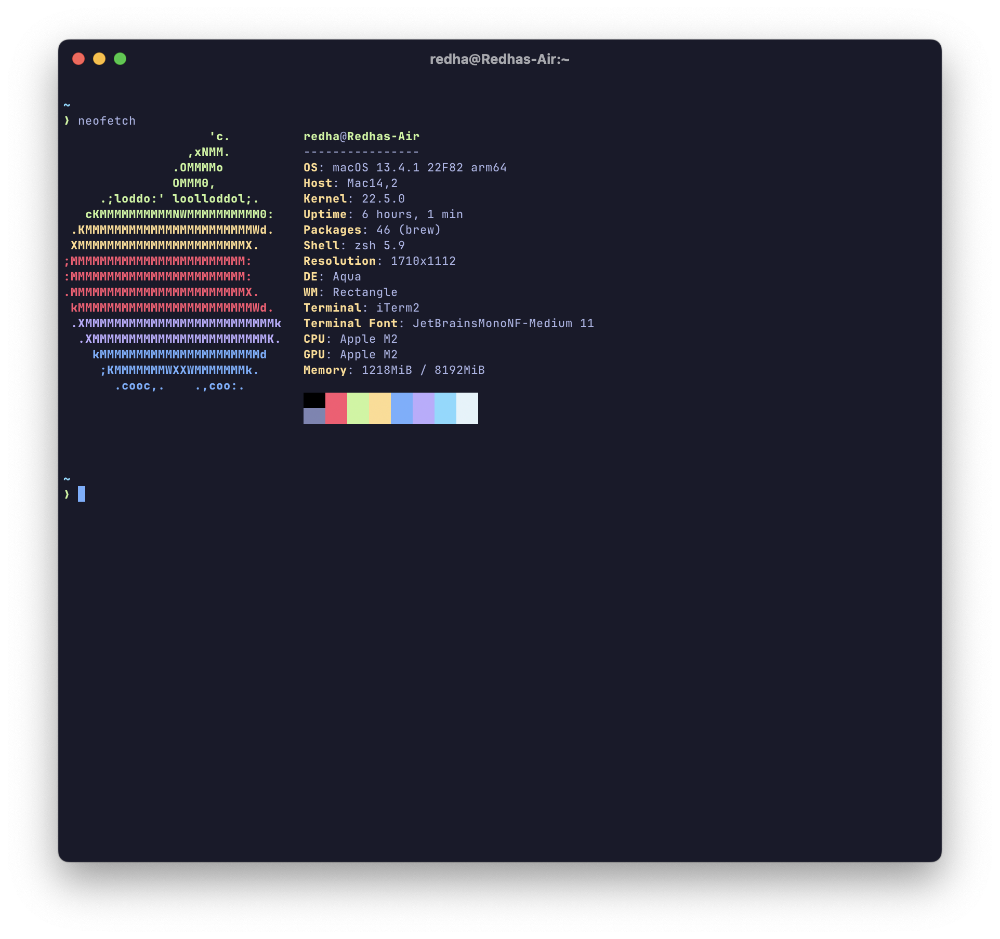
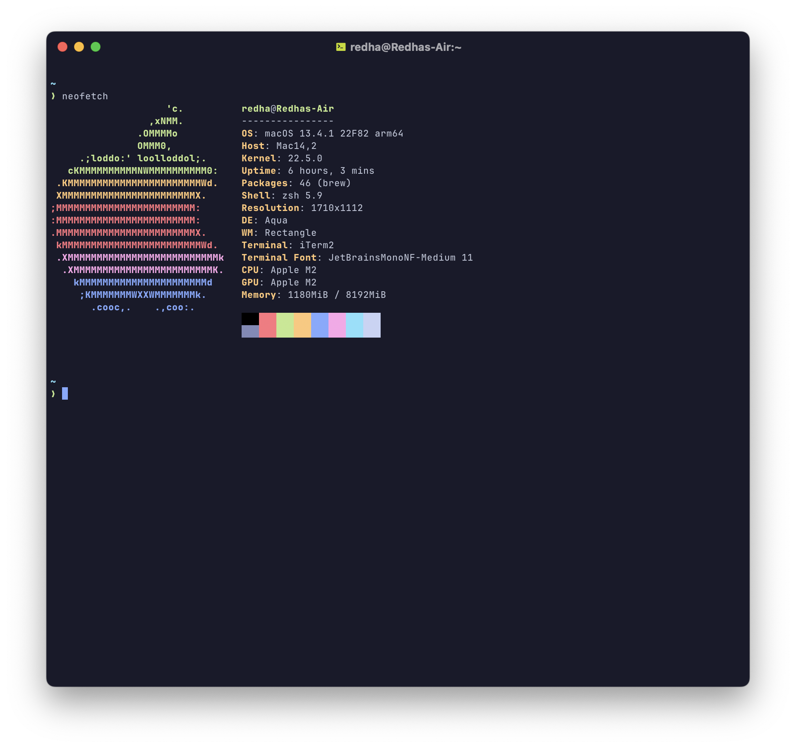
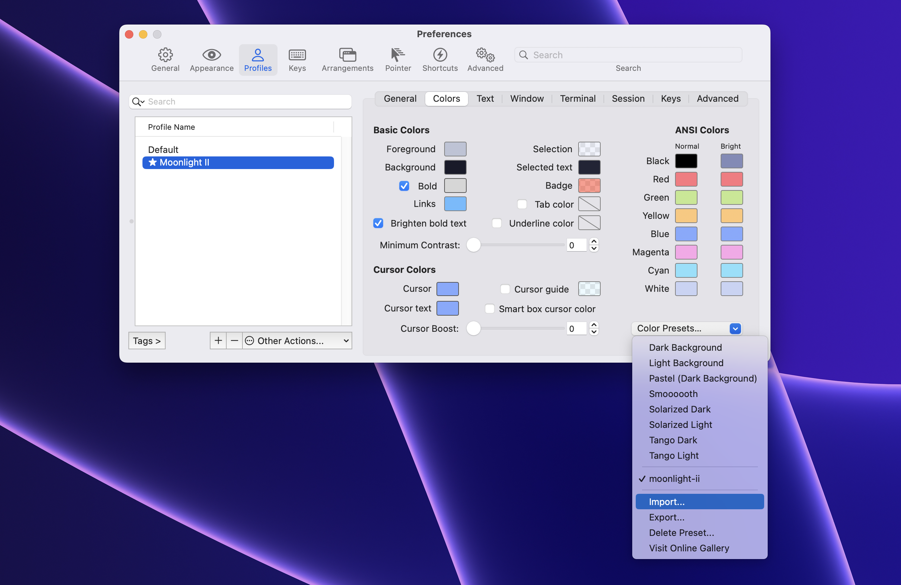

  
  <h1>moonlight-iterm-theme 🌙</h1>

  Unofficial Moonlight theme for iTerm based on <a href="https://marketplace.visualstudio.com/items?itemName=atomiks.moonlight">Moonlight VS Code theme</a>.

## Screenshots

### Moonlight

### Moonlight II

## Installation

1. Download the theme you like
2. Open iTerm and go to `Settings` > `Profile`
3. Import your downloaded theme and you are done!

## Related

- [moonlight-vscode-theme](https://github.com/atomiks/moonlight-vscode-theme)
- [github-moonlight](poimandres)
